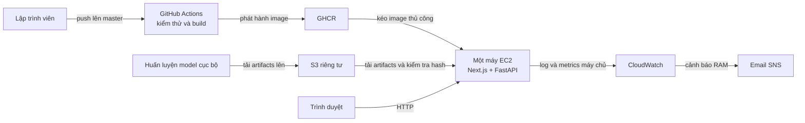

# Báo cáo Workshop Triển khai Ứng dụng trên AWS
## Phân loại Bệnh lá Cà chua với EC2, S3 và CloudWatch

> **Khu vực (Region):** Châu Á - Thái Bình Dương (Sydney) `ap-southeast-2`  
> **Kho mã nguồn:** [starkkk1/plant-disease-detection](https://github.com/starkkk1/plant-disease-detection)  
> **Trạng thái triển khai:** Bản demo trên một máy chủ AWS 
> **Mốc hoàn tất workshop dự kiến:** 27/11/2026 (trước hạn 30/11)

---

### Tóm tắt Tổng quan

Dự án **Plant Disease Detection** đã chuyển từ thử nghiệm PyTorch cục bộ sang một bản demo chạy container trên Amazon Web Services (AWS). Phần triển khai cho thấy cách phục vụ mô hình qua ứng dụng web và theo dõi tài nguyên trên cấu hình đám mây nhỏ; đây chưa phải dịch vụ production hay sản phẩm chẩn đoán nông nghiệp đã được kiểm chứng.

Một máy **Amazon EC2** chạy hai container riêng biệt: giao diện **Next.js** và API suy luận CPU **FastAPI**. **Amazon S3** lưu các tệp mô hình; **Amazon CloudWatch** và **Amazon SNS** cung cấp log, metrics máy chủ và email cảnh báo theo ngưỡng RAM. Việc triển khai và quay lui phiên bản được thực hiện thủ công. Cấu hình chỉ có một máy chủ, khả năng kiểm soát truy cập còn hạn chế và chưa có tính sẵn sàng cao; kết quả mô hình chưa được kiểm định trên dữ liệu thực địa.

---

### Bảng Thông số Cấu hình Ghi nhận

| Hạng mục | Cấu hình Thực tế Được Ghi Nhận |
|---|---|
| **Khu vực AWS (Region)** | Asia Pacific Sydney / `ap-southeast-2` |
| **Dịch vụ AWS Chính** | Amazon EC2, Amazon S3, Amazon CloudWatch |
| **Dịch vụ Hỗ trợ** | AWS IAM, Amazon VPC, Security Groups, Amazon SNS |
| **Ngăn xếp Ứng dụng (Stack)** | Next.js Standalone (Node.js 22), FastAPI, PyTorch (CPU), Docker, GHCR |
| **Mô hình Triển khai** | Một máy EC2 chạy 2 container; triển khai và quay lui thủ công |
| **Kiến trúc Trí tuệ Nhân tạo** | MobileNetV3-Small (Student) được chưng cất tri thức từ ConvNeXt-Tiny (Teacher) |
| **Phạm vi Giám sát** | CloudWatch Agent (CPU, RAM, Đĩa) + 1 Cảnh báo RAM tự động (>85%) |

---

### Sơ đồ Tổng quan Triển khai

Sơ đồ tóm tắt luồng phát hành. Xem [5.3](5.3-architecture-design/) để hiểu kiến trúc và [5.4](5.4-deployment-strategy/) để làm theo các bước triển khai thủ công.

```mermaid
graph LR
    Dev["Lập trình viên"] -->|push lên master| CI["GitHub Actions<br/>kiểm thử và build"]
    CI -->|phát hành image| GHCR["GHCR"]
    Train["Huấn luyện model cục bộ"] -->|tải artifacts lên| S3["S3 riêng tư"]
    GHCR -->|kéo image thủ công| EC2["Một máy EC2<br/>Next.js + FastAPI"]
    S3 -->|tải artifacts và kiểm tra hash| EC2
    User["Trình duyệt"] -->|HTTP| EC2
    EC2 -->|log và metrics máy chủ| CW["CloudWatch"]
    CW -->|cảnh báo RAM| SNS["Email SNS"]
```

---

### Lộ trình Nội dung Workshop

1. **[5.1 Giới thiệu](5.1-workshop-overview/)**
   Giới thiệu bài toán phân loại 11 bệnh lá cà chua, cơ chế chưng cất tri thức mô hình và tính năng giải thích quyết định bằng Grad-CAM++.
2. **[5.2 Chuẩn bị & Cài đặt](5.2-prerequiste/)**
   Cấu hình tài khoản AWS, thiết lập mạng VPC, phân quyền Security Group theo IP máy khách, IAM Instance Profile và cài đặt Docker Engine.
3. **[5.3 Kiến trúc & Thiết kế](5.3-architecture-design/)**
   Ranh giới hệ thống, vai trò các thành phần, thiết kế một máy chủ và cách artifacts S3 được kết nối với API.
4. **[5.4 Chiến lược Triển khai](5.4-deployment-strategy/)**
   CI phát hành image, tải artifacts và kiểm tra mã băm thủ công, khởi chạy container và xác minh ứng dụng.
5. **[5.5 Giám sát & Bảo mật](5.5-quality-assurance/)**
   Log container, metrics máy chủ và cảnh báo RAM qua CloudWatch, cùng các biện pháp giới hạn truy cập và container trong bản demo.
6. **[5.6 Vận hành & Thu hồi](5.6-operations-cleanup/)**
   Quy trình bật/tắt hằng ngày, cập nhật public IP, xóa tài nguyên demo và kiểm tra các tài nguyên còn tính phí.
